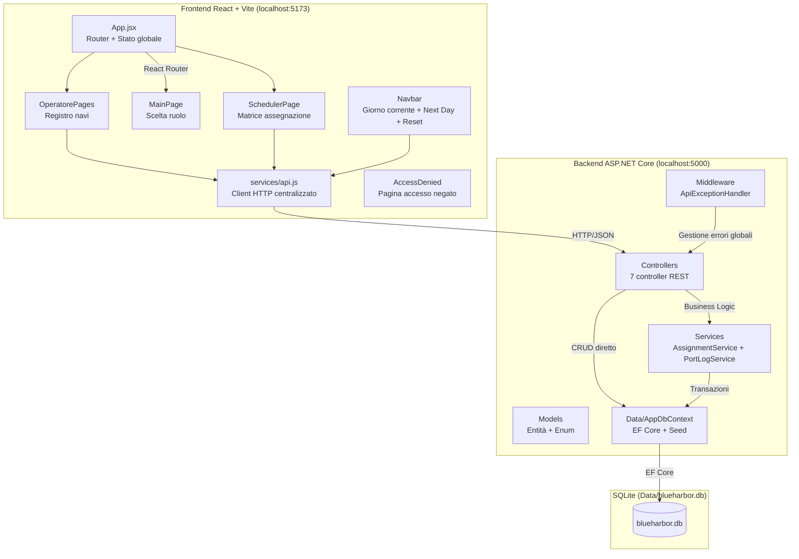
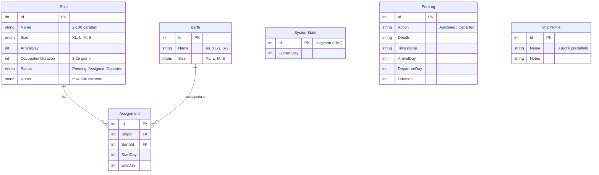

# Documentazione Tecnica — BlueHarbor Port Terminal Management System

**Versione:** 1.0  
**Data:** Luglio 2026  
**Stato:** Progetto completo e funzionante

---

## Indice

1. [Panoramica del progetto e obiettivi](#1-panoramica-del-progetto-e-obiettivi)
2. [Architettura generale](#2-architettura-generale)
3. [Struttura di cartelle e moduli](#3-struttura-di-cartelle-e-moduli)
4. [Tecnologie e dipendenze](#4-tecnologie-e-dipendenze)
5. [Descrizione dettagliata dei moduli](#5-descrizione-dettagliata-dei-moduli)
6. [API e interfacce](#6-api-e-interfacce)
7. [Configurazione e setup](#7-configurazione-e-setup)
8. [Test e CI/CD](#8-test-e-cicd)
9. [Limiti noti e sviluppi futuri](#9-limiti-noti-e-sviluppi-futuri)

---

## 1. Panoramica del progetto e obiettivi

### 1.1 Scopo del sistema

BlueHarbor è un **gestionale per terminal portuale** che simula le operazioni quotidiane di un porto fittizio. Il sistema permette a un operatore di registrare le navi in arrivo, a uno scheduler di assegnarle alle banchine compatibili, e di avanzare un giorno operativo virtuale che aggiorna automaticamente lo stato delle navi.

### 1.2 Contesto formativo

Il progetto è stato sviluppato per il corso **Learning by Project** dell'ITS Web Solutions Architect. L'obiettivo formativo era dimostrare la capacità di progettare e integrare un'applicazione **full-stack** con:

- Separazione delle responsabilità tra frontend, backend e database
- Regole di business non banali (compatibilità taglie, calcolo finestre temporali, prevenzione conflitti)
- Scelte tecnologiche coerenti con un contesto didattico

### 1.3 Funzionalità implementate

| Funzionalità | Stato | Note |
|---|---|---|
| Registrazione e consultazione navi | ✅ Implementato | Con generazione automatica di taglia, arrivo e durata |
| Autocompletamento note da catalogo | ✅ Implementato | Se il nome corrisponde a un profilo noto (case-insensitive) |
| 8 banchine fisse per taglia | ✅ Implementato | 1 XL, 1 L, 2 M, 4 S — seed in AppDbContext |
| Assegnazione nave–banchina con vincoli | ✅ Implementato | Taglia compatibile, assenza overlap, transazione serializzabile |
| Avanzamento giorno operativo | ✅ Implementato | Stato navi: Pending → Assigned → Departed |
| Interfaccia web per due ruoli operativi | ✅ Implementato | Operatore / Scheduler |
| Catalogo ShipProfile (8 navi predefinite) | ✅ Implementato | Task Salome — autocompletamento note |
| Statistiche in basso (KDI) | ✅ Implementato | Task Mirko KDI — stats in Operatore e Scheduler |
| Logo MSC e contrasto WCAG AA | ✅ Implementato | Task Mirko Operatore Upgrade |
| Test automatici | ✅ Implementato | 6 test xUnit, tutti superati |
| Logging operativo (PortLog) | ✅ Implementato | Solo backend, non esposto in UI |

---

## 2. Architettura generale

### 2.1 Pattern architetturale

Il sistema adotta un'architettura **Client–Server** con API **REST** e payload **JSON**.



### 2.2 Flusso di dati principali

**Flusso registrazione nave (Operatore):**
```
Operatore → compila nome + note → Frontend genera taglia/arrivo/durata
→ POST /api/ships → ShipsController → Status=Pending → INSERT SQLite
→ Ricarica GET /api/ships
```

**Flusso assegnazione (Scheduler):**
```
Scheduler → seleziona nave Pending → clic/drag su banchina compatibile
→ POST /api/assignments { shipId, berthId }
→ AssignmentService (transazione serializzabile):
  1. Verifica: nave Pending, taglia compatibile
  2. Calcola startDay = max(currentDay, lastEndDay+1, arrivalDay)
  3. Calcola endDay = startDay + duration - 1
  4. Verifica assenza overlap
  5. UPDATE Ship.Status → Assigned
  6. INSERT Assignment
  7. COMMIT + log "Assigned"
```

**Flusso avanzamento giorno:**
```
Navbar → POST /api/advance-day
→ SystemController:
  1. CurrentDay++
  2. Trova navi Pending con ArrivalDay < CurrentDay (warning)
  3. Trova assegnazioni con EndDay < CurrentDay e nave Assigned
  4. Per ciascuna: Ship.Status → Departed + log "Departed"
```

### 2.3 Modello dati e relazioni



---

## 3. Struttura di cartelle e moduli

### 3.1 Repository root

```
wsa-sushi-project/
├── README.md                          # Manuale d'uso (livello didattico)
├── .gitignore
├── backend/                           # Progetto ASP.NET Core
│   ├── BlueHarbor.API.csproj          # File di progetto .NET
│   ├── Program.cs                     # Bootstrap: DI, CORS, Swagger, migrazioni
│   ├── appsettings.json               # Configurazione ambiente
│   ├── appsettings.Development.json   # Configurazione sviluppo
│   ├── BlueHarbor.API.http            # File richieste HTTP (VS Code REST Client)
│   ├── Controllers/                   # 7 controller REST
│   │   ├── ShipsController.cs
│   │   ├── BerthsController.cs
│   │   ├── AssignmentsController.cs
│   │   ├── SystemController.cs
│   │   ├── AdminController.cs
│   │   ├── PortLogsController.cs
│   │   └── ShipProfilesController.cs
│   ├── Services/
│   │   ├── IAssignmentService.cs
│   │   ├── AssignmentService.cs       # Logica critica: assegnazione con transazione
│   │   ├── IPortLogService.cs
│   │   └── PortLogService.cs          # Logging operativo fail-safe
│   ├── Models/
│   │   ├── Ship.cs                    # Entità nave
│   │   ├── Berth.cs                   # Entità banchina
│   │   ├── Assignment.cs              # Entità assegnazione
│   │   ├── SystemState.cs             # Giorno corrente (singleton)
│   │   ├── PortLog.cs                 # Log eventi operativi
│   │   ├── ShipProfile.cs             # Catalogo navi predefinite
│   │   ├── ShipSize.cs                # Enum: XL, L, M, S
│   │   └── ShipStatus.cs              # Enum: Pending, Assigned, Departed
│   ├── Data/
│   │   ├── AppDbContext.cs            # EF Core: DbSet, seed, indici
│   │   └── blueharbor.db              # Database SQLite (gitignored)
│   ├── Middleware/
│   │   └── ApiExceptionHandler.cs     # Gestione globale eccezioni
│   ├── Migrations/                    # Migrazioni EF Core
│   │   ├── 20260721093923_AddShipProfileCatalog.cs
│   │   └── 20260722091132_InitialCreate.cs
│   └── Properties/
│       └── launchSettings.json        # Profili di avvio IIS Express / console
├── frontend/                          # Applicazione React + Vite
│   ├── package.json
│   ├── vite.config.js
│   ├── index.html
│   ├── public/
│   └── src/
│       ├── main.jsx
│       ├── App.jsx                    # Router, stato globale, ProtectedRoute
│       ├── App.css
│       ├── pages/
│       │   ├── MainPage.jsx           # Home con selezione ruolo
│       │   ├── OperatorePages.jsx     # Registro navi (CRUD)
│       │   ├── SchedulerPage.jsx      # Matrice di assegnazione
│       │   ├── MainPage.scss
│       │   ├── OperatorePages.scss
│       │   └── SchedulerPage.scss
│       ├── components/
│       │   ├── Navbar.jsx             # Giorno corrente, Next Day, Reset
│       │   ├── AccessDenied.jsx       # Pagina accesso negato
│       │   └── Navbar.scss
│       ├── services/
│       │   └── api.js                 # Client HTTP centralizzato
│       ├── styles/
│       │   ├── _theme.scss            # Token colore tema chiaro (WCAG AA)
│       │   └── _variables.scss
│       └── hooks/
│           └── useFocusTrap.js        # Hook accessibilità per modali
├── docs/
│   ├── BLUEHARBOR_PROJECT_REPORT.md   # Report architetturale (precedente)
│   ├── DOCUMENTAZIONE_TECNICA.md      # Questo file
│   └── REPORT_ANALISI_PROGETTO.md    # Analisi e audit del codice
└── BlueHarbor.API.Tests/             # Progetto test xUnit
    ├── BlueHarbor.API.Tests.csproj
    ├── AssignmentServiceTests.cs      # 5 test sulla logica di assegnazione
    └── PortLogServiceTests.cs         # 1 test sul logging
```

---

## 4. Tecnologie e dipendenze

### 4.1 Backend

| Tecnologia | Versione | Ruolo | Motivazione |
|---|---|---|---|
| **.NET / ASP.NET Core** | 10.0 | Framework web | Dependency injection nativa, middleware pipeline, controller REST |
| **Entity Framework Core** | 10.0.x | ORM | Modellazione dominio, query LINQ, seed dati, gestione schema |
| **SQLite** | — (via EF Core) | Database | Zero configurazione, file singolo, ideale per demo locali |
| **Swashbuckle (Swagger)** | 10.2.x | Documentazione API | Test interattivo, accessibile su root `http://localhost:5000` |
| **System.Text.Json** | built-in | Serializzazione JSON | Supporto enum stringa via `JsonStringEnumConverter` |

### 4.2 Frontend

| Tecnologia | Versione | Ruolo | Motivazione |
|---|---|---|---|
| **React** | 19.2.x | UI | Component-based, ecosistema maturo |
| **Vite** | 8.x | Build tool | Dev server veloce con HMR, build ottimizzata |
| **React Router** | 7.x | Routing client-side | Protezione rotte per ruolo via ProtectedRoute |
| **Sass (SCSS)** | 1.100.x | Stili | Modulari per pagina, mixin, variabili tema |
| **lucide-react** | 1.23.x | Icone | Icone SVG leggere, al posto di librerie pesanti |

### 4.3 Testing

| Tecnologia | Versione | Ruolo |
|---|---|---|
| **xUnit** | 3.2.2 | Framework test .NET |
| **EF Core InMemory** | 10.0.9 | Database fittizio per test isolati |
| **Microsoft.NET.Test.Sdk** | 17.14.1 | Runner test (`dotnet test`) |

### 4.4 Motivazione delle scelte tecniche

- **SQLite** elimina la necessità di installare un server database separato. Il file `.db` è portabile e il `.gitignore` lo esclude dal repository.
- **ASP.NET Core** offre controller ben definiti, dependency injection e middleware pipeline out-of-the-box.
- **React + Vite** permette sviluppo rapido con hot reload su porta separata (richiede CORS).
- **Service layer minimo** invece di un'architettura a molti servizi: la complessità reale del dominio è concentrata nell'assegnazione; il resto sono operazioni CRUD dirette su EF Core.
- **Enum type-safe** anziché stringhe magiche: il compilatore verifica i valori ammessi, riducendo bug silenziosi. Gli enum sono serializzati come stringhe JSON per compatibilità frontend.

---

## 5. Descrizione dettagliata dei moduli

### 5.1 Backend

#### 5.1.1 Program.cs — Bootstrap dell'applicazione

Registra tutti i servizi necessari all'avvio:
- **Controller** con serializzazione JSON enum stringa
- **Swagger** su route root (`http://localhost:5000`)
- **ApiBehaviorOptions** — normalizza errori di validazione in risposte JSON con campo `error`
- **ApiExceptionHandler** — middleware globale per eccezioni non gestite (500)
- **AppDbContext** — connessione SQLite a `Data/blueharbor.db`
- **IAssignmentService / IPortLogService** — service layer (Scoped, un'istanza per richiesta HTTP)
- **CORS** — policy limitata a `http://localhost:5173`
- **Migrazione automatica** — `db.Database.Migrate()` all'avvio

#### 5.1.2 Controllers (7)

Ogni controller è decorato con `[ApiController]` (validazione automatica ModelState) e `[Route("api/[controller]")]`.

| Controller | Route base | Endpoint | Dettaglio |
|---|---|---|---|
| **ShipsController** | `/api/ships` | `GET /` | Lista navi, filtro opzionale `?status=Pending` |
| | | `GET /{id}` | Singola nave per ID |
| | | `POST /` | Crea nave (forza Status=Pending, autocompleta note da catalogo se nome matcha) |
| | | `PUT /{id}` | Modifica nome e note (solo se Pending) |
| | | `DELETE /{id}` | Elimina nave (solo se Pending) |
| **BerthsController** | `/api/berths` | `GET /` | Banchine con assegnazione corrente (se occupata oggi) |
| **AssignmentsController** | `/api/assignments` | `GET /` | Lista assegnazioni con Ship e Berth |
| | | `GET /{id}` | Singola assegnazione |
| | | `POST /` | Crea assegnazione (delega ad AssignmentService) |
| **SystemController** | `/api` | `GET /day` | Giorno corrente `{ currentDay }` |
| | | `POST /advance-day` | Avanza giorno, marca navi partite, restituisce warning |
| **AdminController** | `/api` | `POST /reset` | Cancella navi e assegnazioni, ripristina giorno 1 |
| **PortLogsController** | `/api/portlogs` | `GET /` | Storico eventi ordinati per timestamp descrescente |
| **ShipProfilesController** | `/api/shipprofiles` | `GET /` | Elenco profili navi predefiniti |

**Nota sul disallineamento PUT nave (incongruenza documentata):**  
Il frontend `OperatorePages.jsx` invia `size`, `arrivalDay`, `occupationDuration` e `status` nel PUT, ma il backend `UpdateShipDto` accetta solo `Name` e `Notes`. I campi extra vengono ignorati silenziosamente dal model binder. Questa incongruenza è nota e segnalata: la UI mostra campi editabili che non vengono persistiti. La scelta qui è di documentare il comportamento reale del codice (UpdateShipDto accetta solo nome e note) e segnalare la discordanza come limite noto.

#### 5.1.3 Services

**IAssignmentService / AssignmentService** (logica critica)

È il cuore del sistema. Implementa `AssignShipToBerthAsync(shipId, berthId)` con questi passaggi:

1. **Validazione entità**: nave e banchina esistono
2. **Stato nave**: deve essere `Pending`
3. **Compatibilità taglia**: `ship.Size == berth.Size`
4. **Calcolo finestra temporale**:
   - `lastEndDay = MAX(EndDay)` delle assegnazioni esistenti sulla banchina, o `currentDay - 1`
   - `firstFreeDay = MAX(currentDay, lastEndDay + 1)`
   - `startDay = MAX(ship.ArrivalDay, firstFreeDay)`
   - `endDay = startDay + ship.OccupationDuration - 1`
5. **Verifica overlap**: `AnyAsync(a => a.BerthId == berthId && startDay <= a.EndDay && endDay >= a.StartDay)`
6. **Transazione serializzabile**: `BeginTransactionAsync(IsolationLevel.Serializable)`
7. **Persistenza**: UPDATE Ship.Status = Assigned, INSERT Assignment
8. **Log**: chiama PortLogService con azione "Assigned"

**IPortLogService / PortLogService** (logging fail-safe)

Scrive eventi operativi (`Assigned`, `Departed`) su tabella `PortLogs`. Gli errori di logging vengono catturati e scritti su console senza far fallire l'operazione principale (pattern fail-safe). Implementato come servizio separato estratto dal DbContext tramite `IInfrastructure<IServiceProvider>`.

#### 5.1.4 Middleware

**ApiExceptionHandler.cs** — implementa `IExceptionHandler` (ASP.NET Core 8+). Cattura eccezioni non gestite, restituisce 500 con `{ error: messaggio }`. È registrato in `Program.cs` con `AddExceptionHandler<ApiExceptionHandler>()` e `UseExceptionHandler()`.

#### 5.1.5 Data Layer (AppDbContext)

Configurazione EF Core con:

- **DbSet**: Ships, Berths, Assignments, SystemStates, PortLogs, ShipProfiles
- **Seed dati**:
  - 8 banchine: XL-1 (XL), L-1 (L), M-1 (M), M-2 (M), S-1..S-4 (S)
  - SystemState con CurrentDay = 1
  - 8 ShipProfile (Poseidon Express, Ocean Trader, ecc.)
- **Indici**: `Ship.Status`, `Ship.ArrivalDay`, `Assignment.ShipId`
- **Vincolo unicità**: `(BerthId, StartDay, EndDay)` — previene duplicati esatti (non overlap parziali, gestiti dal service)

**⚠️ Nota sulle migrazioni:** I file in `Migrations/` hanno timestamp invertiti rispetto all'ordine cronologico: `AddShipProfileCatalog` (21 luglio 2026) è stata creata prima di `InitialCreate` (22 luglio 2026). Su un clone pulito, `db.Database.Migrate()` in `Program.cs` potrebbe fallire. Soluzione: generare una nuova migration iniziale che unisca entrambe, oppure rinominare i file per ordine corretto.

#### 5.1.6 Modelli

- **Ship**: campi `Id, Name, Size (enum), ArrivalDay, OccupationDuration (3-15), Status (enum), Notes`. Validazioni DataAnnotations.
- **Berth**: campi `Id, Name, Size (enum)`.
- **Assignment**: campi `Id, ShipId (+ nav prop Ship), BerthId (+ nav prop Berth), StartDay, EndDay`.
- **SystemState**: singleton (Id=1), campo `CurrentDay`.
- **PortLog**: campi `Id, Action, Details, Timestamp, ArrivalDay, DepartureDay, Duration`.
- **ShipProfile**: campi `Id, Name, Notes` — 8 record fissi via seed.
- **ShipSize enum**: `XL, L, M, S`
- **ShipStatus enum**: `Pending, Assigned, Departed`

### 5.2 Frontend

#### 5.2.1 App.jsx — Router e stato globale

- React Router con tre rotte: `/` (MainPage), `/operatore` (OperatorePages), `/scheduler` (SchedulerPage)
- Stato globale: `currentDay` (sincronizzato con `GET /api/day` all'avvio), `ships`, `userRole`
- **ProtectedRoute**: verifica il ruolo in `localStorage` (`blueharbor-role`). Se nessun ruolo, reindirizza a `/`. Se ruolo errato, mostra `<AccessDenied>`.
- Ruolo selezionato persiste in `localStorage` e viene rimosso al Reset
- `handleNextDay`: chiama `POST /api/advance-day` e aggiorna currentDay
- `handleReset`: conferma utente, chiama `POST /api/reset`, ricarica pagina

#### 5.2.2 Navbar

- Visibile solo fuori dalla home (`/`)
- Brand "BlueHarbor Terminal" con logo MSC
- Navigazione contestuale al ruolo (Home + Operatore oppure Home + Scheduler)
- Giorno corrente sincronizzato
- Pulsante **Next Day** — chiamata POST all'API
- Pulsante **Reset** — conferma + chiamata POST
- Menu mobile responsive con hamburger

#### 5.2.3 MainPage.jsx — Home e selezione ruolo

Presenterà due card interattive: **Operatore** e **Scheduler**. Il ruolo selezionato viene passato a `handleRoleSelect` in App.jsx.

#### 5.2.4 OperatorePages.jsx — Registro navi

Funzionalità:
- **Form creazione**: inserisce nome (obbligatorio) e note (opzionali)
  - `generateShipData()` genera taglia casuale (XL/L/M/S), arrivalDay (+0-31 giorni), duration (3-15 giorni)
  - POST /api/ships con lo status forzato a Pending
- **Lista navi**: scheda per nave con chip taglia, badge stato tradotto (Pending → "In attesa", Assigned → "Assegnata", Departed → "Partita"), dettagli arrivo/durata/note
- **Statistiche in basso**: totale navi, in attesa, assegnate, partite
- **Modifica inline**: form che mostra campi nome, taglia, arrivo, durata, note
  - ⚠️ Solo nome e note vengono effettivamente salvati (UpdateShipDto)
- **Eliminazione**: solo navi in stato Pending
- **Pluralizzazione corretta**: "1 nave" / "N navi"

#### 5.2.5 SchedulerPage.jsx — Matrice di assegnazione

Funzionalità:
- **Coda navi Pending**: sidebar con navi filtrate da `GET /api/ships?status=Pending`
- **Griglia 8 banchine**: ogni card mostra stato (DISPONIBILE/PIANIFICATA/OCCUPATA), nave attuale, finestra temporale, timeline 7 giorni
- **Selezione nave**: click o drag-and-drop dalla coda
- **Assegnazione**: click o drop su banchina compatibile (stessa taglia) → modal conferma con anteprima finestra
  - `calcSlotReal()` replica la logica backend per l'anteprima (valore non autoritativo)
  - Al POST, la finestra reale viene dal backend (fonte di verità)
- **Warning navi in ritardo**: se pending con arrivalDay <= currentDay
- **Toast notifica**: 4 secondi dopo assegnazione
- **USE_MOCK = false**: il codice mock rimane ma è disattivato
- **Barra utilizzo terminale**: segmenti colorati per occupazione complessiva

#### 5.2.6 services/api.js — Client HTTP centralizzato

Wrapper `request()` che:
- Costruisce URL con `BASE_URL = "http://localhost:5000/api"`
- Aggiunge header `Content-Type: application/json`
- Estrae campo `error` o `errors` dal body JSON in caso di errore
- Restituisce `null` per status 204 (No Content)

Funzioni esportate: `getShips, createShip, updateShip, deleteShip, getBerths, getAssignments, createAssignment, getCurrentDay, advanceDay, resetSystem`.

**⚠️ Manca getShipProfiles():** l'endpoint `/api/shipprofiles` esiste ma non è chiamato dal frontend.

---

## 6. API e interfacce

### 6.1 Endpoint REST completi

| Metodo | Path | Body richiesta | Risposta successo | Codici errore |
|---|---|---|---|---|
| GET | `/api/ships?status=` | — | `200` array Ship | — |
| GET | `/api/ships/{id}` | — | `200` Ship | `404` |
| POST | `/api/ships` | Ship JSON | `201` Ship creata | `400` validazione |
| PUT | `/api/ships/{id}` | `{ name, notes }` | `200` Ship aggiornata | `400`, `404` |
| DELETE | `/api/ships/{id}` | — | `204` No Content | `404`, `409` (non Pending) |
| GET | `/api/berths` | — | `200` array con stato attuale | — |
| GET | `/api/assignments` | — | `200` array con Ship e Berth | — |
| GET | `/api/assignments/{id}` | — | `200` Assignment | `404` |
| POST | `/api/assignments` | `{ shipId, berthId }` | `201` Assignment | `400`, `409` (overlap/incompatibile) |
| GET | `/api/day` | — | `{ currentDay }` | — |
| POST | `/api/advance-day` | — | `{ newDay, departedCount, departedShips, warning }` | — |
| POST | `/api/reset` | — | `{ message }` | `500` |
| GET | `/api/portlogs` | — | `200` array log | — |
| GET | `/api/shipprofiles` | — | `200` array profili | — |

### 6.2 Formato errori

Tutti gli errori REST seguono il formato:
```json
{ "error": "messaggio di errore leggibile" }
```

I codici HTTP utilizzati: `400` (Bad Request — input non valido), `404` (Not Found), `409` (Conflict — regola di business violata), `500` (Internal Server Error — eccezione non gestita).

### 6.3 DTO

- **UpdateShipDto**: `{ name (string, 2-100 char), notes (string, max 500) }` — usato in PUT /api/ships/{id}
- **AssignmentRequest**: `{ shipId (int), berthId (int) }` — record usato in POST /api/assignments

---

## 7. Configurazione e setup

### 7.1 File di configurazione

| File | Contenuto |
|---|---|
| `appsettings.json` | Stringa connessione SQLite, logging, Kestrel |
| `appsettings.Development.json` | Override per ambiente di sviluppo |
| `Properties/launchSettings.json` | Profili avvio (porta 5000, variabili ambiente) |

### 7.2 Variabili d'ambiente

Il backend non richiede variabili d'ambiente obbligatorie. In sviluppo, `ASPNETCORE_ENVIRONMENT` può essere impostata a `Development` (configurata in `launchSettings.json`).

### 7.3 BASE_URL frontend

In `frontend/src/services/api.js`: `BASE_URL = "http://localhost:5000/api"`. In produzione andrebbe configurata come variabile d'ambiente.

### 7.4 Prerequisiti

| Software | Versione verificata | Ruolo |
|---|---|---|
| .NET SDK | 10.0.302 | Compilazione ed esecuzione backend |
| Node.js + npm | compatibile con Vite 8 | Gestione pacchetti frontend |
| Browser moderno | Chrome, Firefox, Edge | Esecuzione frontend |

### 7.5 Avvio

```bash
# Terminale 1 — Backend
cd backend
dotnet run
# → http://localhost:5000 (Swagger incluso)

# Terminale 2 — Frontend
cd frontend
npm install
npm run dev
# → http://localhost:5173
```

### 7.6 Primo avvio — Database

Alla prima esecuzione, il backend tenta `db.Database.Migrate()`. Se le migrazioni hanno ordine cronologico invertito (problema noto, vedi §9), eseguire manualmente:

```bash
cd backend
dotnet ef migrations add InitialCreate
dotnet ef database update
```

Il database SQLite viene creato in `Data/blueharbor.db` (gitignored).

---

## 8. Test e CI/CD

### 8.1 Test automatici

6 test xUnit nel progetto `BlueHarbor.API.Tests/`:

**AssignmentServiceTests** (5 test):
1. `AssignShipToBerth_ValidAssignment_CalculatesCorrectStartAndEndDay` — verifica calcolo corretto della finestra
2. `AssignShipToBerth_IncompatibleSize_ThrowsException` — rifiuta taglia diversa
3. `AssignShipToBerth_ShipAlreadyAssigned_ThrowsException` — rifiuta nave già assegnata
4. `AssignShipToBerth_BerthOverlap_MovesToNextAvailableWindow` — sposta slot in avanti su overlap
5. `AssignShipToBerth_RespectsFormula_MaxArrivalDayLastEndDayPlusOne` — rispetta arrivalDay futuro

**PortLogServiceTests** (1 test):
6. `LogAsync_CreatesLogEntry` — verifica persistenza log con metadati

**Esecuzione:**
```bash
dotnet test BlueHarbor.API.Tests/BlueHarbor.API.Tests.csproj
```

**Output atteso:** 6/6 superati, 0 falliti.

**⚠️ Test mancanti:** non esistono test per `ShipProfilesController`, `ShipsController.CreateShip` (autocompletamento note), né per gli altri controller.

### 8.2 CI/CD

Non è presente configurazione CI/CD (GitHub Actions, Jenkins, ecc.). Il progetto è pensato per esecuzione locale.

---

## 9. Limiti noti e sviluppi futuri

### 9.1 Limitazioni attuali

| Limitazione | Tipo | Dettaglio |
|---|---|---|
| **Nessuna autenticazione** | By design | Ruoli simulati via localStorage, nessun login reale |
| **Nessuna paginazione** | By design | Volume dati ridotto, accettabile per demo |
| **Nessuna containerizzazione** | By design | Non richiesta per contesto didattico |
| **Disallineamento modifica nave** | Gap UI/API | Frontend invia campi extra (size, arrivalDay, etc.) che backend ignora |
| **Migration invertite** | Gap tecnico | Timestamp fuori ordine: AddShipProfileCatalog prima di InitialCreate |
| **PortLog non esposto in UI** | Gap funzionale | API `/api/portlogs` disponibile ma nessuna pagina frontend la usa |
| **Frontend non chiama ShipProfiles** | Gap minore | Endpoint presente ma `api.js` non ha `getShipProfiles()` |
| **Test mancanti per ShipProfiles** | Gap test | Nessun test per il catalogo o l'autocompletamento note |
| **Database gitignored** | By design | Ogni sviluppatore genera il proprio `.db` |

### 9.2 Rischi tecnici

- **Concorrenza sulle assegnazioni**: La transazione serializzabile mitiga ma non elimina completamente il rischio di double-booking su SQLite in scenari multi-thread. In contesto didattico monoutente non è un problema.
- **Ordine migrazioni**: Su database pulito, `db.Database.Migrate()` potrebbe fallire per l'ordine invertito dei timestamp delle migrazioni.
- **AccessDenied non integrato storicamente**: Nel codice attuale è già integrato in ProtectedRoute (riga 19 di App.jsx), ma la documentazione precedente lo segnalava come componente orphan.

### 9.3 Suggerimenti per sviluppi futuri

1. **Correggere migrazioni EF Core**: unificare in una sola `InitialCreate` che includa anche ShipProfiles
2. **Allineare UI modifica nave**: rimuovere campi extra dal form di edit (size, arrivalDay, duration) oppure estendere `UpdateShipDto`
3. **Pagina storico PortLog**: aggiungere sezione frontend per visualizzare i log operativi
4. **Test per ShipProfiles**: aggiungere test xUnit per l'autocompletamento note e l'endpoint profili
5. **Aggiungere getShipProfiles()** in `api.js` e mostrare legenda nel form di creazione
6. **Test di integrazione API**: usare `WebApplicationFactory` per testare i controller
7. **Autenticazione base**: se il progetto dovesse evolvere oltre il contesto didattico
8. **Docker Compose**: per avvio unificato backend + frontend

---

## Appendice A: Glossario

| Termine | Significato |
|---|---|
| **API** | Application Programming Interface — interfaccia che permette a due sistemi (frontend e backend) di comunicare |
| **ASP.NET Core** | Framework Microsoft per creare applicazioni web e API |
| **Banchina** | Posto barca (ormeggio) nel porto, con taglia associata |
| **CORS** | Cross-Origin Resource Sharing — meccanismo che permette a un frontend di chiamare un backend su porta diversa |
| **CRUD** | Create, Read, Update, Delete — le quattro operazioni base su dati |
| **DTO** | Data Transfer Object — oggetto leggero per trasportare dati tra API |
| **EF Core** | Entity Framework Core — ORM (Object-Relational Mapper) per .NET |
| **EF Core InMemory** | Database fittizio in memoria, usato nei test per isolare la logica senza file reali |
| **Enum** | Enumerazione — tipo di dato con valori fissi (es. XL, L, M, S) |
| **JSON** | JavaScript Object Notation — formato leggero per scambiare dati |
| **ORM** | Object-Relational Mapper — strumento che traduce oggetti del codice in tabelle del database |
| **REST** | Representational State Transfer — stile architetturale per API web |
| **Seed** | Dati iniziali inseriti nel database alla prima creazione |
| **Singleton** | Oggetto che esiste in una sola istanza (es. SystemState con CurrentDay) |
| **SQLite** | Database leggero senza server, basato su file singolo |
| **Swagger** | Interfaccia web interattiva per testare le API |
| **Transazione serializzabile** | Livello di isolamento massimo: impedisce accessi concorrenti ai dati |
| **xUnit** | Framework di test per .NET |
| **WCAG AA** | Standard di accessibilità web (contrasto 4.5:1 per testo normale) |

---
