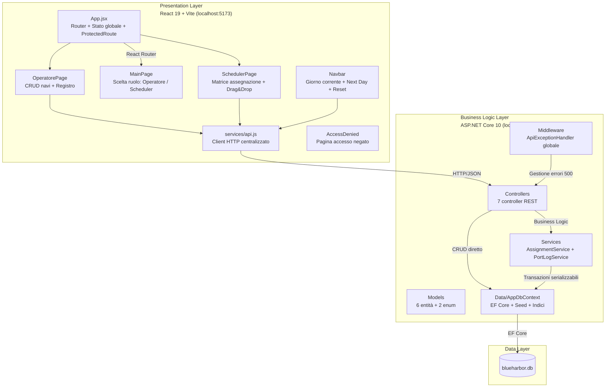
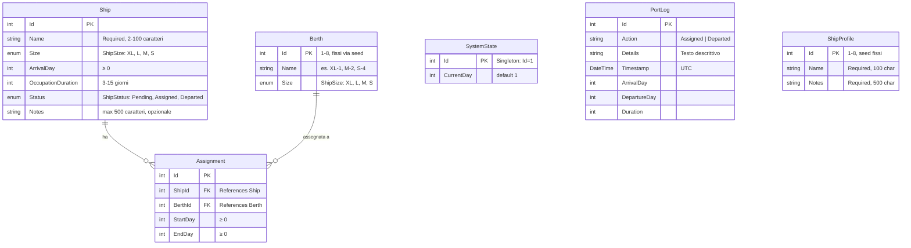

# BlueHarbor Terminal — Documentazione Finale del Progetto

> **Progetto:** BlueHarbor Terminal — Registro Operativo per Terminal Container  
> **Cliente:** BlueHarbor (Compagnia di Spedizioni)  
> **Sviluppato da:** Team Poseidon — ITS Web Solutions Architect  
> **Versione:** 1.0 — Luglio 2026  
> **Repository:** [https://github.com/bruneipotosi-dev/wsa-sushi-project](https://github.com/bruneipotosi-dev/wsa-sushi-project)

---

# SEZIONE 1 — DOCUMENTAZIONE TECNICA

> Rivolta a sviluppatori, architetti software e tecnici IT.

---

## Indice (Sezione 1)

1. [Architettura del Sistema](#11-architettura-del-sistema)
2. [Modello Dati](#12-modello-dati)
3. [Logiche di Business Critiche](#13-logiche-di-business-critiche)
4. [API Endpoints](#14-api-endpoints)
5. [Tecnologie e Dipendenze](#15-tecnologie-e-dipendenze)
6. [Struttura del Progetto](#16-struttura-del-progetto)
7. [Configurazione e Setup](#17-configurazione-e-setup)
8. [Test](#18-test)
9. [Limiti Noti e Sviluppi Futuri](#19-limiti-noti-e-sviluppi-futuri)

---

## 1.1 Architettura del Sistema

### 1.1.1 Pattern Architetturale

BlueHarbor Terminal adotta un'architettura **Client–Server** a **3 strati** (Three-Tier Architecture) con comunicazione via API **REST** e payload **JSON**:

| Strato | Tecnologia | Ruolo |
|---|---|---|
| **Presentation Layer** (Frontend) | React 19 + Vite | Interfaccia utente, routing lato client, gestione stato locale |
| **Business Logic Layer** (Backend) | ASP.NET Core 10 | API REST, validazione regole di dominio, servizi di assegnazione |
| **Data Layer** (Database) | SQLite via EF Core 10 | Persistenza, seed dati iniziali, vincoli di integrità |

### 1.1.2 Diagramma Architetturale



### 1.1.3 Flussi di Dati Principali

**Flusso Registrazione Nave (Ruolo Operatore):**

```
Operatore → Compila nome + note opzionali
→ Frontend genera automaticamente: taglia (casuale), arrivalDay (casuale), occupationDuration (casuale)
→ POST /api/ships → ShipsController.CreateShip()
    → Ship.Status forzato a Pending (sicurezza, anche se il client inviasse altro)
    → Autocompletamento Notes dal catalogo ShipProfile (se nome matcha)
    → INSERT Ship nel database
→ Risposta 201 Created con oggetto Ship
→ Ricarica GET /api/ships per aggiornare la lista
```

**Flusso Assegnazione (Ruolo Scheduler):**

```
Scheduler → Seleziona nave Pending → Clic/Drag su banchina compatibile
→ POST /api/assignments { shipId, berthId } → AssignmentsController.CreateAssignment()
→ Delega a AssignmentService.AssignShipToBerthAsync():
     1. Verifica esistenza nave e banchina
     2. Verifica ship.Status == Pending
     3. Verifica ship.Size == berth.Size (compatibilità taglia)
     4. Calcola finestra temporale:
        - lastEndDay = MAX(EndDay) delle assegnazioni esistenti sulla banchina (o currentDay - 1)
        - firstFreeDay = MAX(currentDay, lastEndDay + 1)
        - startDay = MAX(ship.ArrivalDay, firstFreeDay)
        - endDay = startDay + ship.OccupationDuration - 1
     5. Verifica assenza overlap con AnyAsync
     6. Avvia transazione serializzabile (IsolationLevel.Serializable)
     7. UPDATE Ship.Status → Assigned
     8. INSERT Assignment
     9. COMMIT transazione
     10. Log "Assigned" su PortLog
→ Risposta 201 Created con finestra temporale calcolata
```

**Flusso Avanzamento Giorno (Next Day):**

```
Navbar → POST /api/advance-day → SystemController.AdvanceDay()
     1. SystemState.CurrentDay++
     2. Trova navi Pending con ArrivalDay < CurrentDay (genera warning, non bloccante)
     3. Trova assegnazioni con EndDay < CurrentDay E nave in stato Assigned
     4. Per ciascuna: Ship.Status → Departed
     5. Log "Departed" su PortLog per ogni nave partita
     6. Salva modifiche (db.SaveChangesAsync)
→ Risposta: { newDay, departedCount, departedShips[], warning? }
```

### 1.1.4 Decisioni Architetturali Rilevanti

| Decisione | Motivazione |
|---|---|
| **Service layer minimo** | Solo `AssignmentService` e `PortLogService` come servizi dedicati. Le operazioni CRUD sono gestite direttamente dai controller su DbContext per semplicità. La complessità reale del dominio è concentrata nell'assegnazione. |
| **Transazioni serializzabili** | Livello di isolamento massimo per prevenire double-booking in scenari concorrenti. Su SQLite monoutente è cautelativo, ma documenta l'intenzione architetturale. |
| **Enum type-safe** | `ShipSize` e `ShipStatus` come enum C# serializzati in stringhe JSON (`JsonStringEnumConverter`). Elimina stringhe magiche, garantisce type-checking a compile-time. |
| **Autocompletamento catalogo** | `ShipProfile` con 8 record seed. Match case-insensitive sul nome. Pattern "convention over configuration" per velocizzare l'inserimento. |
| **Singleton SystemState** | Un singolo record (Id=1) con `CurrentDay`. Pattern semplice per modello "Next Day". |
| **CORS limitato** | Policy configurata solo per `http://localhost:5173` (frontend Vite). Nessun wildcard. |

### 1.1.5 Gestione della Concorrenza

Il sistema è progettato per un contesto **monoutente** (un solo operatore alla volta). La transazione serializzabile in `AssignmentService.cs` (riga 37) fornisce protezione aggiuntiva contro accessi concorrenti, ma in questo contesto didattico non viene realmente testata sotto carico.

```csharp
// AssignmentService.cs — riga 37
await using var tx = await _db.Database.BeginTransactionAsync(System.Data.IsolationLevel.Serializable);
```

---

## 1.2 Modello Dati

### 1.2.1 Entity Relationship Diagram



### 1.2.2 Entità Dettagliate

#### **Ship** (`backend/Models/Ship.cs`)

| Proprietà | Tipo | Vincoli | Descrizione |
|---|---|---|---|
| `Id` | `int` | PK, auto-increment | Identificatore univoco |
| `Name` | `string` | Required, `[StringLength(100, MinimumLength = 2)]` | Nome della nave (es. "MSC Aurora") |
| `Size` | `ShipSize` (enum) | Required, `[EnumDataType]` | Taglia: XL, L, M, S |
| `ArrivalDay` | `int` | `[Range(0, 100000)]` | Giorno virtuale di arrivo al porto |
| `OccupationDuration` | `int` | `[Range(3, 15)]` | Durata della sosta in banchina |
| `Status` | `ShipStatus` (enum) | Required, `[EnumDataType]` | Stato: Pending, Assigned, Departed |
| `Notes` | `string?` | `[StringLength(500)]` | Note operative opzionali (autocompilate dal catalogo se nome matcha) |

#### **Berth** (`backend/Models/Berth.cs`)

| Proprietà | Tipo | Vincoli | Descrizione |
|---|---|---|---|
| `Id` | `int` | PK, auto-increment | Identificatore univoco |
| `Name` | `string` | Required, `[StringLength(20, MinimumLength = 2)]` | Nome banchina (es. "XL-1", "S-3") |
| `Size` | `ShipSize` (enum) | Required, `[EnumDataType]` | Taglia della banchina |

**8 banchine fisse (seed in `AppDbContext.OnModelCreating()`):**

| Id | Nome | Taglia |
|---|---|---|
| 1 | XL-1 | XL |
| 2 | L-1 | L |
| 3 | M-1 | M |
| 4 | M-2 | M |
| 5 | S-1 | S |
| 6 | S-2 | S |
| 7 | S-3 | S |
| 8 | S-4 | S |

#### **Assignment** (`backend/Models/Assignment.cs`)

| Proprietà | Tipo | Vincoli | Descrizione |
|---|---|---|---|
| `Id` | `int` | PK, auto-increment | Identificatore univoco |
| `ShipId` | `int` | FK → Ship, `[Range(1, int.MaxValue)]` | Nave assegnata |
| `Ship` | `Ship?` | Navigation property | Nave (caricata con `.Include()`) |
| `BerthId` | `int` | FK → Berth, `[Range(1, int.MaxValue)]` | Banchina assegnata |
| `Berth` | `Berth?` | Navigation property | Banchina (caricata con `.Include()`) |
| `StartDay` | `int` | `[Range(0, int.MaxValue)]` | Giorno di inizio occupazione |
| `EndDay` | `int` | `[Range(0, int.MaxValue)]` | Giorno di fine occupazione (incluso) |

#### **SystemState** (`backend/Models/SystemState.cs`)

| Proprietà | Tipo | Vincoli | Descrizione |
|---|---|---|---|
| `Id` | `int` | PK = 1 (singleton) | Identificatore fisso |
| `CurrentDay` | `int` | default 1 | Giorno virtuale corrente |

#### **PortLog** (`backend/Models/PortLog.cs`)

| Proprietà | Tipo | Descrizione |
|---|---|---|
| `Id` | `int` | PK, auto-increment |
| `Action` | `string` | Tipo evento: "Assigned" o "Departed" |
| `Details` | `string` | Testo descrittivo dell'evento |
| `Timestamp` | `DateTime` | Momento dell'evento (UTC), default `DateTime.UtcNow` |
| `ArrivalDay` | `int` | Giorno di arrivo della nave (metadato) |
| `DepartureDay` | `int` | Giorno di partenza della nave (metadato) |
| `Duration` | `int` | Durata dell'occupazione (metadato) |

#### **ShipProfile** (`backend/Models/ShipProfile.cs`)

| Proprietà | Tipo | Vincoli | Descrizione |
|---|---|---|---|
| `Id` | `int` | PK, auto-increment | Identificatore univoco |
| `Name` | `string` | Required, `[StringLength(100)]` | Nome del profilo nave |
| `Notes` | `string` | Required, `[StringLength(500)]` | Note del profilo (usate per autocompletamento) |

**8 profili seed:**

| Id | Name | Notes |
|---|---|---|
| 1 | Poseidon Express | Carico containers refrigerati, provenienza Rotterdam. |
| 2 | Ocean Trader | Priorità media, scarico entro fine settimana. |
| 3 | Pacific Pioneer | Nave abitualmente in ritardo, avvisare operatore banchina. |
| 4 | Nautilus Pride | Carico misto, nessuna priorità particolare. |
| 5 | Blue Horizon | Piccolo carico urgente, priorità alta. |
| 6 | Atlantis Leader | Nave gemella della Neptune Star, stesso operatore. |
| 7 | Neptune Star | Container misti, ispezione doganale richiesta all'arrivo. |
| 8 | Titan Carrier | Prima nave della giornata, scarico prioritario. |

### 1.2.3 Enum

**ShipSize** (`backend/Models/ShipSize.cs`):

```csharp
public enum ShipSize
{
    XL = 1,   // Extra Large
    L  = 2,   // Large
    M  = 3,   // Medium
    S  = 4    // Small
}
```

**ShipStatus** (`backend/Models/ShipStatus.cs`):

```csharp
public enum ShipStatus
{
    Pending  = 1,   // In attesa di assegnazione
    Assigned = 2,   // Assegnata a una banchina
    Departed = 3    // Partita dal porto
}
```

### 1.2.4 Indici e Vincoli Database

Configurati in `AppDbContext.OnModelCreating()`:

| Tabella | Indice/Vincolo | Tipo | Scopo |
|---|---|---|---|
| `Assignment` | `IX_Assignments_ShipId` | Indice | Ricerca rapida per nave |
| `Assignment` | `UX_Assignments_BerthId_StartDay_EndDay` | **UNIQUE** | Previene duplicati esatti sulla stessa banchina (non overlap parziali) |
| `Ship` | `IX_Ships_Status` | Indice | Filtraggio per stato (es. tutte le Pending) |
| `Ship` | `IX_Ships_ArrivalDay` | Indice | Ricerca per giorno di arrivo |

> **Nota:** Il vincolo UNIQUE su `(BerthId, StartDay, EndDay)` previene SOLO duplicati esatti. La protezione da overlap parziali è gestita a livello service in `AssignmentService.cs` con la query di overlap esplicita.

---

## 1.3 Logiche di Business Critiche

### 1.3.1 Modello Temporale "Next Day"

Il sistema utilizza un modello temporale **discreto a giorni interi**, senza ore o minuti. Il tempo avanza esclusivamente tramite il pulsante **Next Day**.

**Implementazione:** `SystemController.AdvanceDay()` (`backend/Controllers/SystemController.cs`)

```csharp
// SystemController.cs — Logica di avanzamento giorno
var state = await _db.SystemStates.FirstAsync();
state.CurrentDay++;  // Incremento giorno

// Navi in ritardo (warning, non bloccante)
var overduePendingCount = await _db.Ships
    .CountAsync(s => s.Status == ShipStatus.Pending && s.ArrivalDay < state.CurrentDay);

// Assegnazioni concluse → navi Departed
var assignmentsEnded = await _db.Assignments
    .Include(a => a.Ship)
    .Where(a => a.EndDay < state.CurrentDay
             && a.Ship!.Status == ShipStatus.Assigned)
    .ToListAsync();

foreach (var assignment in assignmentsEnded)
{
    assignment.Ship!.Status = ShipStatus.Departed;
    // Log "Departed" su PortLog
}
```

**Regole del modello temporale:**

1. **Giorno corrente (CurrentDay):** Inizia a 1, incrementato solo via `POST /api/advance-day`.
2. **Arrivo nave (ArrivalDay):** Giorno in cui la nave è disponibile per l'assegnazione. Può essere futuro.
3. **Inizio occupazione (StartDay):** Calcolato come `MAX(ArrivalDay, firstFreeDay, currentDay)` dove `firstFreeDay` è il primo giorno libero sulla banchina dopo l'ultima assegnazione.
4. **Fine occupazione (EndDay):** `StartDay + OccupationDuration - 1` (inclusivo).
5. **Transizione Departed:** Quando `EndDay < CurrentDay`, la nave passa automaticamente a `Departed`.

### 1.3.2 Prevenzione Double-Booking (Transazione Serializzabile)

Il cuore della logica di dominio è in `AssignmentService.AssignShipToBerthAsync()` (`backend/Services/AssignmentService.cs`).

**Algoritmo completo:**

```
INPUT: shipId, berthId
OUTPUT: Assignment

1. VALIDAZIONE ENTITÀ
   - Ship esiste? NO → ArgumentException
   - Berth esiste? NO → ArgumentException

2. VALIDAZIONE STATO
   - Ship.Status == Pending? NO → InvalidOperationException

3. VALIDAZIONE COMPATIBILITÀ
   - Ship.Size == Berth.Size? NO → InvalidOperationException

4. CALCOLO FINESTRA TEMPORALE
   - lastEndDay = MAX(Assignments.Where(BerthId == berthId).Select(EndDay))
     oppure (currentDay - 1) se nessuna assegnazione
   - firstFreeDay = MAX(currentDay, lastEndDay + 1)
   - startDay = MAX(ship.ArrivalDay, firstFreeDay)
   - endDay = startDay + ship.OccupationDuration - 1

5. VERIFICA OVERLAP
   - AnyAsync(Assignment WHERE BerthId == berthId
     AND startDay <= EndDay AND endDay >= StartDay)
   - Overlap trovato? → InvalidOperationException

6. TRANSAZIONE SERIALIZZABILE
   - BeginTransactionAsync(IsolationLevel.Serializable)
   - UPDATE Ship.Status = Assigned
   - INSERT Assignment
   - COMMIT

7. LOGGING (fail-safe)
   - PortLogService.LogAsync("Assigned", ...)
   - Errori di logging NON fanno fallire l'operazione
```

**Codice chiave della transazione serializzabile:**

```csharp
// AssignmentService.cs — righe 37-91
await using var tx = await _db.Database.BeginTransactionAsync(System.Data.IsolationLevel.Serializable);

try
{
    int lastEndDay = await _db.Assignments
        .Where(a => a.BerthId == berthId)
        .MaxAsync(a => (int?)a.EndDay) ?? (currentDay - 1);

    int firstFreeDay = Math.Max(currentDay, lastEndDay + 1);
    int startDay = Math.Max(ship.ArrivalDay, firstFreeDay);
    int endDay = startDay + ship.OccupationDuration - 1;

    bool overlap = await _db.Assignments.AnyAsync(a =>
        a.BerthId == berthId &&
        startDay <= a.EndDay && endDay >= a.StartDay);

    if (overlap)
        throw new InvalidOperationException("La banchina è già occupata in quella finestra temporale.");

    // Persistenza
    ship.Status = ShipStatus.Assigned;
    _db.Ships.Update(ship);
    _db.Assignments.Add(assignment);
    await _db.SaveChangesAsync();
    await tx.CommitAsync();

    // Logging
    // ...
}
catch
{
    await tx.RollbackAsync();
    throw;
}
```

**Perché `IsolationLevel.Serializable`?** È il livello di isolamento più rigoroso in SQL. Previene fenomeni di `dirty read`, `non-repeatable read` e `phantom read`. In pratica, garantisce che due transazioni concorrenti non possano creare assegnazioni sovrapposte sulla stessa banchina. In un contesto monoutente è cautelativo, ma documenta l'intenzione di prevenire il double-book anche in futuro.

### 1.3.3 Autocompletamento Note dal Catalogo ShipProfile

Quando un Operatore registra una nave senza note, il backend cerca automaticamente un profilo corrispondente nel catalogo `ShipProfiles` tramite match **case-insensitive** sul nome:

```csharp
// ShipsController.cs — righe 77-86
if (string.IsNullOrWhiteSpace(ship.Notes))
{
    var profile = await _db.ShipProfiles
        .FirstOrDefaultAsync(p => p.Name.ToLower() == ship.Name.ToLower());

    if (profile is not null)
    {
        ship.Notes = profile.Notes;
    }
}
```

### 1.3.4 Regole di Assegnazione per Taglia

La matrice di compatibilità è una corrispondenza **1:1 esatta**: una nave di taglia X può essere assegnata SOLO a una banchina di taglia X.

| Nave | Banchine compatibili |
|---|---|
| XL | XL-1 |
| L | L-1 |
| M | M-1, M-2 |
| S | S-1, S-2, S-3, S-4 |

### 1.3.5 Logging Operativo (PortLogService)

`PortLogService` registra ogni evento "Assigned" e "Departed" con metadati (arrivalDay, departureDay, duration). La classe è implementata come servizio separato estratto dal DbContext tramite `IInfrastructure<IServiceProvider>` per evitare dipendenze circolari. Gli errori di logging vengono catturati e non interrompono mai l'operazione principale (pattern **fail-safe**):

```csharp
// PortLogService.cs — righe 31-35
catch (Exception ex)
{
    // Il logging non deve mai far fallire l'operazione principale
    Console.WriteLine($"[PortLog Error] {ex.Message}");
}
```

---

## 1.4 API Endpoints

### 1.4.1 Elenco Completo

| Metodo | Path | Descrizione | Controller | Codici Risposta |
|---|---|---|---|---|
| `GET` | `/api/ships` | Elenco navi (filtro opzionale `?status=Pending/Assigned/Departed`) | ShipsController | `200` |
| `GET` | `/api/ships/{id}` | Dettaglio singola nave | ShipsController | `200`, `404` |
| `POST` | `/api/ships` | Crea nuova nave (forza Status=Pending, autocompleta note) | ShipsController | `201`, `400` |
| `PUT` | `/api/ships/{id}` | Modifica nome e note (solo se Pending) | ShipsController | `200`, `400`, `404` |
| `DELETE` | `/api/ships/{id}` | Elimina nave (solo se Pending) | ShipsController | `204`, `404`, `409` |
| `GET` | `/api/berths` | Elenco banchine con stato corrente e occupazione attuale | BerthsController | `200` |
| `GET` | `/api/assignments` | Elenco assegnazioni (include Ship e Berth) | AssignmentsController | `200` |
| `GET` | `/api/assignments/{id}` | Dettaglio singola assegnazione | AssignmentsController | `200`, `404` |
| `POST` | `/api/assignments` | Crea assegnazione `{ shipId, berthId }` (logica transazionale) | AssignmentsController | `201`, `400`, `409` |
| `GET` | `/api/day` | Legge il giorno corrente `{ currentDay }` | SystemController | `200` |
| `POST` | `/api/advance-day` | Avanza di 1 giorno, aggiorna stati navi | SystemController | `200` |
| `POST` | `/api/reset` | Resetta sistema: cancella navi/assegnazioni, giorno=1 | AdminController | `200`, `500` |
| `GET` | `/api/portlogs` | Storico eventi (log) ordinati per timestamp decrescente | PortLogsController | `200` |
| `GET` | `/api/shipprofiles` | Catalogo profili navi predefiniti | ShipProfilesController | `200` |

### 1.4.2 Formato Richieste e Risposte

**POST /api/ships** (Richiesta):
```json
{
    "name": "MSC Aurora",
    "notes": "Carico containers refrigerati",
    "size": "M",
    "arrivalDay": 15,
    "occupationDuration": 5,
    "status": "Pending"
}
```

**POST /api/ships** (Risposta 201):
```json
{
    "id": 42,
    "name": "MSC Aurora",
    "size": "M",
    "arrivalDay": 15,
    "occupationDuration": 5,
    "status": "Pending",
    "notes": "Carico containers refrigerati"
}
```

**POST /api/assignments** (Richiesta):
```json
{
    "shipId": 42,
    "berthId": 3
}
```

**POST /api/assignments** (Risposta 201):
```json
{
    "id": 15,
    "shipId": 42,
    "berthId": 3,
    "startDay": 15,
    "endDay": 19,
    "shipName": "MSC Aurora",
    "shipSize": "M",
    "berthName": "M-1"
}
```

**POST /api/advance-day** (Risposta 200):
```json
{
    "newDay": 12,
    "departedCount": 2,
    "departedShips": [
        { "shipId": 40, "shipName": "Ocean Trader" },
        { "shipId": 41, "shipName": "Pacific Pioneer" }
    ],
    "warning": "3 navi in attesa con arrivo già passato."
}
```

### 1.4.3 Formato Errori (Uniforme)

Tutti gli errori REST seguono il formato standard:

```json
{ "error": "messaggio di errore leggibile" }
```

Codici HTTP utilizzati:
- `400` Bad Request — validazione fallita, input non valido
- `404` Not Found — entità non trovata
- `409` Conflict — regola di business violata (es. nave già assegnata, taglia incompatibile, overlap)
- `500` Internal Server Error — eccezione non gestita (catturata da `ApiExceptionHandler`)

### 1.4.4 DTO (Data Transfer Objects)

**UpdateShipDto** (PUT /api/ships/{id}):
```csharp
public class UpdateShipDto
{
    [Required, StringLength(100, MinimumLength = 2)]
    public string Name { get; set; }

    [StringLength(500)]
    public string? Notes { get; set; }
}
```

**AssignmentRequest** (POST /api/assignments):
```csharp
public record AssignmentRequest(int ShipId, int BerthId);
```

### 1.4.5 Swagger UI

L'interfaccia Swagger è disponibile all'avvio del backend su `http://localhost:5000` (route root). Elenca tutti gli endpoint e permette di testarli interattivamente. Configurato in `Program.cs`:

```csharp
app.UseSwagger();
app.UseSwaggerUI(c =>
{
    c.SwaggerEndpoint("/swagger/v1/swagger.json", "BlueHarbor API V1");
    c.RoutePrefix = string.Empty;  // Swagger su root
});
```

---

## 1.5 Tecnologie e Dipendenze

### 1.5.1 Backend (`BlueHarbor.API.csproj`)

| Tecnologia | Versione | Ruolo |
|---|---|---|
| .NET SDK / ASP.NET Core | 10.0 (net10.0) | Framework web, dependency injection, controller REST |
| Entity Framework Core Sqlite | 10.0.8 | ORM, query LINQ, migration, seed dati |
| Entity Framework Core Design | 10.0.9 | Strumenti di design per migrazioni |
| Swashbuckle (Swagger) | 10.2.1 | Documentazione API interattiva |
| Microsoft.AspNetCore.OpenApi | 10.0.8 | Supporto OpenApi per ASP.NET Core |
| System.Text.Json | built-in | Serializzazione JSON (con `JsonStringEnumConverter`) |
| SQLitePCLRaw.core | 3.0.3 | Driver SQLite nativo (core) |
| SQLitePCLRaw.lib.e_sqlite3 | 2.1.12 | Driver SQLite nativo (binario) |

### 1.5.2 Frontend (`frontend/package.json`)

| Tecnologia | Versione | Ruolo |
|---|---|---|
| React | ^19.2.6 | UI component-based |
| React DOM | ^19.2.6 | Render DOM per React |
| Vite | ^8.0.12 | Build tool, dev server con HMR |
| React Router DOM | ^7.17.0 | Routing lato client, ProtectedRoute |
| Sass (SCSS) | ^1.100.0 | Stili modulari, variabili tema |
| lucide-react | ^1.23.0 | Icone SVG leggere |

### 1.5.3 Testing

| Tecnologia | Versione | Ruolo |
|---|---|---|
| xUnit | 3.2.2 | Framework test .NET |
| EF Core InMemory | 10.0.9 | Database fittizio per test isolati |
| Microsoft.NET.Test.Sdk | 17.14.1 | Runner test |

### 1.5.4 Motivazione delle Scelte Tecniche

- **SQLite:** Elimina la necessità di installare un server database separato. Il file `.db` è portabile e gitignored. Perfetto per demo locali e contesto didattico.
- **Service layer minimo:** Solo `AssignmentService` e `PortLogService` come servizi dedicati. Il resto sono CRUD diretti su DbContext. Scelta consapevole: la complessità reale del dominio è concentrata nell'assegnazione.
- **Enum string in JSON:** `JsonStringEnumConverter` serializza gli enum come stringhe (es. `"Pending"` invece di `1`), migliorando la leggibilità delle API e la compatibilità col frontend.
- **React + Vite:** Build tool moderno con Hot Module Replacement, configurazione zero per progetti semplici.
- **Protected Route:** Pattern di autorizzazione lato client basato su `localStorage` (non sicurezza reale, ma separazione funzionale didattica).

---

## 1.6 Struttura del Progetto

```
wsa-sushi-project/
│
├── README.md                           # Manuale d'uso (utente finale)
│
├── backend/                            # Progetto ASP.NET Core
│   ├── BlueHarbor.API.csproj           # File di progetto .NET 10
│   ├── Program.cs                      # Bootstrap: DI, CORS, Swagger, Migrations
│   ├── appsettings.json                # Configurazione ambiente
│   ├── appsettings.Development.json    # Override sviluppo
│   ├── BlueHarbor.API.http             # File richieste HTTP (VS Code REST Client)
│   │
│   ├── Controllers/                    # 7 controller REST
│   │   ├── ShipsController.cs          # CRUD navi
│   │   ├── BerthsController.cs         # Lettura banchine con stato
│   │   ├── AssignmentsController.cs    # Creazione/lettura assegnazioni
│   │   ├── SystemController.cs         # Giorno corrente + Advance Day
│   │   ├── AdminController.cs          # Reset sistema
│   │   ├── PortLogsController.cs       # Storico log
│   │   └── ShipProfilesController.cs   # Catalogo profili
│   │
│   ├── Services/
│   │   ├── IAssignmentService.cs       # Interfaccia servizio assegnazione
│   │   ├── AssignmentService.cs        # Logica critica: assegnazione transazionale
│   │   ├── IPortLogService.cs          # Interfaccia servizio logging
│   │   └── PortLogService.cs           # Logging operativo fail-safe
│   │
│   ├── Models/
│   │   ├── Ship.cs                     # Entità nave
│   │   ├── Berth.cs                    # Entità banchina
│   │   ├── Assignment.cs               # Entità assegnazione
│   │   ├── SystemState.cs              # Giorno corrente (singleton)
│   │   ├── PortLog.cs                  # Log eventi operativi
│   │   ├── ShipProfile.cs              # Catalogo navi predefinite
│   │   ├── ShipSize.cs                 # Enum: XL, L, M, S
│   │   └── ShipStatus.cs               # Enum: Pending, Assigned, Departed
│   │
│   ├── Data/
│   │   ├── AppDbContext.cs             # EF Core: DbSet, seed 8 banchine, 8 profili, indici
│   │   └── blueharbor.db              # Database SQLite (gitignored)
│   │
│   ├── Middleware/
│   │   └── ApiExceptionHandler.cs      # Gestione globale eccezioni HTTP 500
│   │
│   ├── Migrations/                     # Migrazioni EF Core (unificate)
│   │   ├── 20260721093923_AddShipProfileCatalog.cs
│   │   ├── 20260721093923_AddShipProfileCatalog.Designer.cs
│   │   └── AppDbContextModelSnapshot.cs
│   │
│   ├── BlueHarbor.API.Tests/           # Progetto test xUnit
│   │   ├── BlueHarbor.API.Tests.csproj
│   │   ├── AssignmentServiceTests.cs    # 5 test su logica assegnazione
│   │   └── PortLogServiceTests.cs       # 1 test su logging
│   │
│   └── Properties/
│       └── launchSettings.json         # Profilo: porta 5000, HTTP
│
├── frontend/                           # Applicazione React + Vite
│   ├── package.json                    # Dipendenze npm
│   ├── vite.config.js                  # Configurazione Vite
│   ├── index.html                      # Entry point HTML
│   ├── eslint.config.js                # Configurazione ESLint
│   │
│   └── src/
│       ├── main.jsx                    # Punto di ingresso React
│       ├── App.jsx                     # Router, stato globale, ProtectedRoute
│       ├── App.css                     # Stili globali
│       ├── index.css                   # Reset CSS
│       │
│       ├── pages/
│       │   ├── MainPage.jsx            # Home con selezione ruolo
│       │   ├── MainPage.scss
│       │   ├── OperatorePages.jsx      # CRUD navi, registro, statistiche
│       │   ├── OperatorePages.scss
│       │   ├── SchedulerPage.jsx       # Matrice assegnazione, drag&drop
│       │   └── SchedulerPage.scss
│       │
│       ├── components/
│       │   ├── Navbar.jsx              # Barra navigazione: giorno, Next Day, Reset
│       │   ├── Navbar.scss
│       │   ├── AccessDenied.jsx        # Pagina accesso negato
│       │   ├── AccessDenied.scss
│       │   ├── ThemeToggle.jsx         # Pulsante cambio tema chiaro/scuro
│       │   └── ThemeToggle.scss
│       │
│       ├── services/
│       │   └── api.js                  # Client HTTP centralizzato (fetch wrapper)
│       │
│       ├── styles/
│       │   └── _theme.scss             # Token colore: tema scuro + chiaro (WCAG AA)
│       │
│       ├── hooks/
│       │   ├── useTheme.js             # Hook gestione tema (light/dark/system)
│       │   └── useFocusTrap.js         # Hook accessibilità per modali
│       │
│       ├── assets/                     # Asset statici (logo MSC)
│       ├── api/                        # Directory placeholder
│       └── mock/                       # Directory placeholder (USE_MOCK = false)
│
└── docs/                               # Documentazione
    ├── FULL_DOCUMENTATION.md           # QUESTO FILE
    └── REPORT_ANALISI_PROGETTO.md      # Analisi e audit del codice
```

> **Nota:** Il progetto test `BlueHarbor.API.Tests/` è fisicamente situato sotto `backend/BlueHarbor.API.Tests/` nella struttura reale del repository, non alla root del progetto.

---

## 1.7 Configurazione e Setup

### 1.7.1 Prerequisiti

| Software | Versione verificata | Download |
|---|---|---|
| .NET SDK | 10.0.302 o superiore | [dotnet.microsoft.com](https://dotnet.microsoft.com/download) |
| Node.js + npm | Compatibile con Vite 8 | [nodejs.org](https://nodejs.org/) |
| Browser moderno | Chrome/Firefox/Edge | — |

### 1.7.2 Avvio Sviluppo

```bash
# Terminale 1 — Backend (ASP.NET Core su porta 5000)
cd backend
dotnet run
# Output atteso: Now listening on: http://localhost:5000

# Terminale 2 — Frontend (Vite su porta 5173)
cd frontend
npm install        # Solo la prima volta
npm run dev
# Output atteso: ➜ Local: http://localhost:5173/
```

Apri il browser su `http://localhost:5173`.

### 1.7.3 Configurazione

| File | Contenuto chiave |
|---|---|
| `backend/appsettings.json` | Logging, `AllowedHosts: *` |
| `backend/Properties/launchSettings.json` | Porta `5000`, ambiente `Development` |
| `frontend/src/services/api.js` | `BASE_URL = "http://localhost:5000/api"` |
| `frontend/vite.config.js` | Plugin React, nessuna configurazione proxy |

### 1.7.4 Database

Alla prima esecuzione, `Program.cs` esegue automaticamente `db.Database.Migrate()` per creare/aggiornare il database SQLite in `backend/Data/blueharbor.db`.

> **Nota sulle migrazioni:** Le migrazioni EF Core sono state consolidate in un unico file (`AddShipProfileCatalog`). Il precedente problema di timestamp invertiti tra due migrazioni è stato risolto: la migrazione `InitialCreate` è stata rimossa e `AddShipProfileCatalog` ora contiene l'intero schema del database, inclusi i seed dati per banchine, SystemState e ShipProfile. Su un clone pulito, `db.Database.Migrate()` funziona senza errori.

---

## 1.8 Test

### 1.8.1 Suite di Test

6 test xUnit nel progetto `backend/BlueHarbor.API.Tests/`:

**AssignmentServiceTests** (5 test):

| # | Nome Test | Cosa Verifica |
|---|---|---|
| 1 | `AssignShipToBerth_ValidAssignment_CalculatesCorrectStartAndEndDay` | Calcolo corretto della finestra temporale in condizioni normali |
| 2 | `AssignShipToBerth_IncompatibleSize_ThrowsException` | Rifiuto di assegnare nave a banchina di taglia diversa |
| 3 | `AssignShipToBerth_ShipAlreadyAssigned_ThrowsException` | Rifiuto di assegnare nave già in stato Assigned o Departed |
| 4 | `AssignShipToBerth_BerthOverlap_MovesToNextAvailableWindow` | Spostamento automatico della finestra in avanti se c'è overlap |
| 5 | `AssignShipToBerth_RespectsFormula_MaxArrivalDayLastEndDayPlusOne` | Rispetto della formula `startDay = MAX(arrivalDay, lastEndDay + 1)` |

**PortLogServiceTests** (1 test):

| # | Nome Test | Cosa Verifica |
|---|---|---|
| 6 | `LogAsync_CreatesLogEntry` | Creazione corretta di un record di log con metadati |

### 1.8.2 Esecuzione

```bash
dotnet test backend/BlueHarbor.API.Tests/BlueHarbor.API.Tests.csproj
```

**Output atteso:** `Test Run Successful. Total: 6, Passed: 6, Failed: 0`

### 1.8.3 Gap nei Test

| Area non testata | Rischio |
|---|---|
| `ShipProfilesController` | Nessun test per l'autocompletamento note dal catalogo |
| `ShipsController.CreateShip` (autocompletamento) | Nessuna verifica del match case-insensitive |
| `SystemController.AdvanceDay` | Nessun test per la transizione Assigned → Departed |
| `AdminController.Reset` | Nessun test per la cancellazione in transazione |
| Test di integrazione API | Nessun test con `WebApplicationFactory` |

---

## 1.9 Limiti Noti e Sviluppi Futuri

### 1.9.1 Limitazioni Attuali

| Limitazione | Tipo | Descrizione |
|---|---|---|
| **Nessuna autenticazione reale** | By design | Ruoli simulati via `localStorage`. Nessun login, JWT, o sessione. |
| **Nessuna paginazione** | By design | Volume dati ridotto, accettabile per demo didattica. |
| **Disallineamento UI/API modifica nave** | Bug noto | Frontend invia `size, arrivalDay, occupationDuration, status` nel PUT, ma `UpdateShipDto` accetta solo `Name` e `Notes`. I campi extra (editSize, editArrivalDay, editDuration a righe 35-37 di OperatorePages.jsx) vengono ignorati silenziosamente dal model binder. |
| **PortLog non esposto in UI** | Gap funzionale | Endpoint `/api/portlogs` disponibile, ma nessuna pagina frontend lo consuma. |
| **Frontend non chiama ShipProfiles** | Gap minore | `api.js` non espone `getShipProfiles()`. Il catalogo è usato solo backend-side. |
| **USE_MOCK disattivato ma presente** | Debito tecnico | Codice mock rimane in `SchedulerPage.jsx` (`USE_MOCK = false`) ma non è più utilizzato. |
| **Nessuna containerizzazione** | By design | Non richiesta per contesto didattico. |

**Migrazioni risolte:** Il precedente problema di migrazioni EF Core con timestamp invertiti (`AddShipProfileCatalog` vs `InitialCreate`) non è più applicabile. Le migrazioni sono state consolidate in una singola migrazione `AddShipProfileCatalog`. Su un clone pulito, `db.Database.Migrate()` in `Program.cs` funziona correttamente.

### 1.9.2 Suggerimenti per Sviluppi Futuri

1. **Allineare UI modifica nave:** Rimuovere campi "Taglia", "Arrivo", "Durata" dal form di edit oppure estendere `UpdateShipDto` per supportarli.
2. **Pagina storico PortLog:** Aggiungere sezione frontend per visualizzare i log operativi (`GET /api/portlogs`).
3. **Aggiungere `getShipProfiles()` in `api.js`:** Esporre il catalogo al frontend per mostrare suggerimenti nel form di creazione.
4. **Test di integrazione:** Usare `WebApplicationFactory` per test end-to-end dei controller.
5. **Autenticazione base:** Se il progetto dovesse evolvere oltre il contesto didattico, aggiungere login con ruoli reali.
6. **Docker Compose:** Per avvio unificato backend + frontend con un solo comando.
7. **Internazionalizzazione (i18n):** Aggiungere supporto multilingua (almeno IT/EN).
8. **Test per i controller mancanti:** Coprire `ShipProfilesController`, `ShipsController.CreateShip` (autocompletamento), `SystemController.AdvanceDay` e `AdminController.Reset`.

---

## Appendice A: Glossario

| Termine | Significato |
|---|---|
| **API** | Application Programming Interface — interfaccia che permette a due sistemi (frontend e backend) di comunicare |
| **ASP.NET Core** | Framework Microsoft per creare applicazioni web e API |
| **Banchina** | Posto barca (ormeggio) nel porto, con taglia associata |
| **CORS** | Cross-Origin Resource Sharing — meccanismo che permette a un frontend di chiamare un backend su porta diversa |
| **CRUD** | Create, Read, Update, Delete — le quattro operazioni base su dati |
| **DTO** | Data Transfer Object — oggetto leggero per trasportare dati tra API |
| **EF Core** | Entity Framework Core — ORM (Object-Relational Mapper) per .NET |
| **EF Core InMemory** | Database fittizio in memoria, usato nei test per isolare la logica senza file reali |
| **Enum** | Enumerazione — tipo di dato con valori fissi (es. XL, L, M, S) |
| **JSON** | JavaScript Object Notation — formato leggero per scambiare dati |
| **ORM** | Object-Relational Mapper — strumento che traduce oggetti del codice in tabelle del database |
| **REST** | Representational State Transfer — stile architetturale per API web |
| **Seed** | Dati iniziali inseriti nel database alla prima creazione |
| **Singleton** | Oggetto che esiste in una sola istanza (es. SystemState con CurrentDay) |
| **SQLite** | Database leggero senza server, basato su file singolo |
| **Swagger** | Interfaccia web interattiva per testare le API |
| **Transazione serializzabile** | Livello di isolamento massimo: impedisce accessi concorrenti ai dati |
| **xUnit** | Framework di test per .NET |
| **WCAG AA** | Standard di accessibilità web (contrasto 4.5:1 per testo normale) |

---

# SEZIONE 2 — DOCUMENTAZIONE UTENTE (MANUALE CLIENTE BLUEHARBOR)

> Rivolta al personale BlueHarbor non tecnico: operatori portuali, scheduler, manager.

---

## 2.1 Introduzione

### 2.1.1 Cos'è BlueHarbor Terminal?

**BlueHarbor Terminal** è un'applicazione web progettata per gestire le operazioni quotidiane del terminal container BlueHarbor. Il sistema permette di:

- **Registrare le navi** in arrivo al porto, con tutti i loro dati operativi
- **Assegnare le navi alle banchine** disponibili, rispettando vincoli di compatibilità ed evitando conflitti di ormeggio
- **Monitorare lo stato del terminal** in tempo reale: navi in attesa, assegnate, partite
- **Avanzare il giorno operativo** per simulare lo scorrere del tempo e aggiornare automaticamente gli stati delle navi

### 2.1.2 A chi serve?

BlueHarbor Terminal è pensato per due ruoli operativi distinti:

| Ruolo | Responsabilità |
|---|---|
| **👤 Operatore** | Registra le navi in arrivo, ne gestisce i dati anagrafici e le note operative |
| **📅 Scheduler** | Assegna le navi alle banchine compatibili, gestisce la pianificazione dell'ormeggio |

### 2.1.3 Concetti Fondamentali

| Termine | Significato |
|---|---|
| **Nave** | Un'unità navale che arriva al terminal per scaricare/caricare container |
| **Banchina** | Un posto barca (ormeggio) dove la nave si attracca. Ogni banchina ha una **taglia** che determina quali navi può ospitare. |
| **Assegnazione** | L'operazione che collega una nave a una banchina per un periodo di tempo definito |
| **Giorno operativo** | Unità di misura del tempo nel sistema (non ore/minuti reali, ma "giorni virtuali") |
| **Pending** | Stato della nave: in attesa di essere assegnata a una banchina |
| **Assigned** | Stato della nave: è stata assegnata a una banchina |
| **Departed** | Stato della nave: ha completato la sosta ed è partita |

### 2.1.4 Le Banchine del Terminale BlueHarbor

Il terminal dispone di **8 banchine**, ciascuna con una taglia specifica:

| Banchina | Taglia | Compatibilità |
|---|---|---|
| **XL-1** | 🔵 XL (Extra Large) | Solo navi taglia XL |
| **L-1** | 🟢 L (Large) | Solo navi taglia L |
| **M-1, M-2** | 🟡 M (Medium) | Solo navi taglia M |
| **S-1, S-2, S-3, S-4** | 🔴 S (Small) | Solo navi taglia S |

> **Regola importante:** Una nave può essere ormeggiata **solo** a una banchina della sua stessa taglia. Una nave taglia M non può stare su una banchina S, e viceversa.

---

## 2.2 Installazione e Avvio

### 2.2.1 Cosa serve per far funzionare BlueHarbor

Prima di iniziare, assicurati di avere installato:

1. **.NET SDK 10.0** — il "motore" che fa funzionare il server
2. **Node.js con npm** — l'ambiente per eseguire l'interfaccia
3. **Un browser moderno** (Chrome, Firefox, Edge)

> Se non hai questi strumenti, contatta il tuo reparto IT per l'installazione.

### 2.2.2 Passo 1: Avvia il Server (Backend)

Il backend è il cuore del sistema: elabora i dati e li salva. Deve rimanere acceso finché usi BlueHarbor.

```
1. Apri il Terminale (Prompt dei comandi o PowerShell)
2. Spostati nella cartella del backend:
   > cd backend
3. Avvia il server:
   > dotnet run
4. Verifica che il server sia partito:
   Dovresti vedere:
   "Now listening on: http://localhost:5000"
5. NON chiudere questa finestra — lasciala aperta
```

### 2.2.3 Passo 2: Avvia l'Interfaccia (Frontend)

Il frontend è la parte che vedi nel browser. Si avvia in un secondo terminale.

```
1. Apri un SECONDO Terminale (nuova finestra)
2. Spostati nella cartella del frontend:
   > cd frontend
3. Scarica le librerie necessarie (SOLO la prima volta):
   > npm install
4. Avvia l'interfaccia:
   > npm run dev
5. Verifica che sia partita:
   Dovresti vedere:
   "Local: http://localhost:5173/"
6. NON chiudere questa finestra
```

### 2.2.4 Passo 3: Apri BlueHarbor nel Browser

```
1. Apri il browser (Chrome, Firefox o Edge)
2. Digita nella barra degli indirizzi:
   http://localhost:5173
3. Premi Invio
```

**Vedrai la schermata principale** con il logo BlueHarbor e due pulsanti: **Operatore** e **Scheduler**.

> **Nota:** Se non vedi nulla o vedi un errore, verifica che entrambi i terminali (backend e frontend) siano ancora aperti e funzionanti.

---

## 2.3 Guida per l'Operatore

### 2.3.1 Come registrare una nuova nave

> **Ruolo richiesto:** Operatore

Quando arriva una nuova nave al terminal, devi registrarla nel sistema. Ecco come fare:

**Passaggi:**

1. Dalla schermata principale, clicca su **Operatore**
2. Nella sezione **"Registra nuova nave"**, inserisci:
   - **Nome nave** (obbligatorio) — ad esempio `MSC Aurora`
   - **Note operative** (opzionale) — ad esempio `Carico di containers refrigerati dalla Cina`
3. Clicca su **"Registra nave"**

`[Inserire qui screenshot del form di registrazione nave]`

**Cosa succede automaticamente:**

Il sistema genera automaticamente alcuni dati tecnici per velocizzare l'inserimento:

| Cosa viene generato | Come | Esempio |
|---|---|---|
| **Taglia della nave** | Scelta casuale tra XL, L, M, S | `M` (Medium) |
| **Giorno di arrivo** | Casualmente tra oggi e oggi+31 giorni | `Giorno 15` |
| **Durata della sosta** | Casualmente tra 3 e 15 giorni | `5 giorni` |

**Autocompletamento Note:**

Se il nome della nave corrisponde a uno dei **profili predefiniti** nel catalogo BlueHarbor (es. "Poseidon Express", "Ocean Trader", "Neptune Star"), le note vengono compilate automaticamente. Puoi comunque modificarle se necessario.

### 2.3.2 Come visualizzare le navi registrate

Dopo aver registrato una nave, appare nella sezione **"Registro navi"**, sotto il form di registrazione. Ogni nave viene mostrata con:

- **Nome** della nave
- **Taglia** (badge colorato: XL, L, M, S)
- **Stato** attuale:
  - 🟡 **In attesa** (Pending) — in coda, pronta per essere assegnata
  - 🔵 **Assegnata** (Assigned) — ha una banchina assegnata
  - ⚫ **Partita** (Departed) — ha lasciato il terminal
- **Giorno di arrivo** e **durata prevista**
- **Note operative** (se presenti)

`[Inserire qui screenshot del Registro Navi]`

### 2.3.3 Come modificare o eliminare una nave

**Puoi modificare o eliminare SOLO navi in stato "In attesa".** Una volta assegnata o partita, la nave non può più essere modificata.

**Per modificare:**
1. Nella lista navi, clicca su **✏️** (matita) accanto alla nave che vuoi modificare
2. Si apre un form di modifica dove puoi cambiare nome e note
3. Clicca su **"Salva"** per confermare

**Per eliminare:**
1. Nella lista navi, clicca su **❌** (X) accanto alla nave che vuoi eliminare
2. Il sistema chiede conferma: clicca **OK**
3. La nave viene cancellata definitivamente

**⚠️ Attenzione:** L'eliminazione è permanente e non può essere annullata.

### 2.3.4 Statistiche

Nella parte inferiore della pagina Operatore trovi un riepilogo numerico:

| Statistica | Significato |
|---|---|
| **Totale navi** | Numero complessivo di navi registrate |
| **In attesa** | Navi non ancora assegnate |
| **Assegnate** | Navi con banchina assegnata |
| **Partite** | Navi che hanno completato la sosta |

---

## 2.4 Guida per lo Scheduler

### 2.4.1 La Matrice di Assegnazione

> **Ruolo richiesto:** Scheduler

La schermata principale dello scheduler si chiama **"Matrice di Assegnazione"** ed è composta da due aree principali:

1. **A sinistra — Coda di attesa:** Elenco di tutte le navi in stato "In attesa" (Pending)
2. **A destra — Griglia banchine:** Le 8 banchine del terminal con il loro stato attuale

`[Inserire qui screenshot della Matrice di Assegnazione]`

### 2.4.2 Come interpretare la griglia delle banchine

Ogni banchina nella griglia mostra:

- **Nome banchina** (es. XL-1, M-2, S-4)
- **Stato attuale**, indicato da un colore:
  - 🟢 **DISPONIBILE** — Banchina libera, pronta per accogliere una nave
  - 🟡 **PIANIFICATA** — Banchina prenotata per una nave in arrivo nei prossimi giorni
  - 🔴 **OCCUPATA** — Banchina attualmente occupata da una nave
- **Nome della nave** che la occupa (se occupata o pianificata)
- **Finestra temporale** (es. G15–G19)
- **Timeline 7 giorni** che mostra l'occupazione giorno per giorno

**Barra di occupazione del terminale:**

Nella parte superiore, una barra colorata mostra la percentuale di banchine occupate/pianificate rispetto al totale, per un colpo d'occhio immediato.

### 2.4.3 Come assegnare una nave a una banchina

**Metodo 1 — Clic:**

1. Nella **Coda di attesa**, clicca su una nave per selezionarla (si illumina)
2. Le banchine **compatibili** (stessa taglia) si illuminano — le altre si oscurano
3. Clicca sulla banchina desiderata
4. Si apre una **finestra di conferma** con i dettagli dell'assegnazione
5. Clicca **"Conferma"** per completare

**Metodo 2 — Drag & Drop:**

1. Nella **Coda di attesa**, clicca e tieni premuto su una nave
2. Trascinala sopra una banchina compatibile
3. Rilascia per aprire la finestra di conferma

**Finestra di conferma:**

La finestra mostra un riepilogo dell'assegnazione proposta:

```
NAVE: MSC Aurora (M)
→ BANCHINA: M-1
GIORNO INIZIO: G15
GIORNO FINE: G19
DURATA: 5 giorni
```

Clicca **"Conferma"** per procedere o **"Annulla"** per tornare indietro.

`[Inserire qui screenshot della finestra di conferma assegnazione]`

**Notifica:** Dopo la conferma, una notifica temporanea (toast) appare in basso per confermare l'avvenuta assegnazione.

### 2.4.4 Come vengono calcolati i giorni di assegnazione

Il sistema calcola automaticamente la finestra temporale migliore seguendo queste regole:

1. La nave **non può arrivare prima** del suo giorno di arrivo registrato
2. La nave **non può occupare** la banchina prima del giorno corrente
3. Se la banchina è già occupata, la nave viene spostata **subito dopo** l'ultima occupazione
4. Due navi **non possono mai** sovrapporsi sulla stessa banchina

**Esempio pratico:**

| Condizione | Valore |
|---|---|
| Oggi (giorno corrente) | Giorno 10 |
| Nave "MSC Aurora" arriva il | Giorno 15 |
| Banchina M-1 è occupata fino al | Giorno 18 |
| Durata sosta nave | 5 giorni |
| **Risultato:** La nave viene assegnata da **Giorno 19 a Giorno 23** |

> ⚠️ **Importante:** Il sistema **non assegna mai** una nave in un "buco" libero tra due occupazioni esistenti. Le assegnazioni sono sempre sequenziali per garantire la massima prevedibilità.

### 2.4.5 Warning navi in ritardo

Se ci sono navi in attesa con un giorno di arrivo già passato, nella parte superiore della pagina appare un **avviso giallo**:

```
⚠️ Attenzione: 2 navi in attesa già arrivate
```

Questo significa che queste navi sono in attesa di assegnazione da troppo tempo. È consigliabile assegnarle il prima possibile.

---

## 2.5 Gestione del Tempo (Next Day)

### 2.5.1 Il pulsante "Next Day"

Nella barra di navigazione in alto (navbar), trovi:

```
📅 Giorno 10    [➡ Next Day]    [🔄 Reset]
```

Il **giorno corrente** mostra in quale giorno operativo ci troviamo.

### 2.5.2 Cosa succede quando premi "Next Day"

Premendo **Next Day**, il sistema esegue automaticamente queste operazioni:

1. **Il giorno corrente aumenta di 1** (es. da Giorno 10 a Giorno 11)
2. **Le navi che hanno completato la sosta** vengono marcate come **"Partite"** (Departed). Una nave parte quando il suo `EndDay` è inferiore al nuovo giorno corrente.
3. **Viene generato un avviso** se ci sono navi in attesa con arrivo già passato

**Esempio:**

1. Assegni "MSC Aurora" dal Giorno 15 al Giorno 19
2. Premi **Next Day** fino al Giorno 20
3. Nella lista navi (ruolo Operatore), "MSC Aurora" ora è **"Partita"**
4. La banchina M-1 è ora **libera** per una nuova nave

### 2.5.3 Quando usare "Next Day"

- **Dopo ogni assegnazione** per simulare il passaggio del tempo
- **Quando vuoi liberare banchine** per nuove navi
- **Alla fine del turno** per aggiornare lo stato del terminal

### 2.5.4 Il pulsante "Reset"

Il pulsante **Reset** cancella **TUTTI** i dati del sistema:

- Tutte le navi vengono eliminate
- Tutte le assegnazioni vengono eliminate
- Il giorno corrente torna a **1**

> ⚠️ **Attenzione:** Questa operazione NON può essere annullata. Il sistema ti chiederà conferma prima di procedere.

**A cosa serve Reset:** Per ricominciare da capo durante una dimostrazione o un test.

---

## 2.6 Risoluzione Problemi (FAQ)

### ❓ Domanda 1: "Cosa succede se provo ad assegnare una nave XL a una banchina S?"

**Risposta:** L'assegnazione **non viene accettata**. Il sistema mostra un messaggio di errore:

```
"Dimensione incompatibile: nave XL, banchina S."
```

Una nave può essere ormeggiata **solo** a una banchina della stessa taglia. Consulta la tabella delle banchine nella sezione [2.1.4](#214-le-banchine-del-terminale-blueharbor) per trovare la banchina corretta.

**Soluzione:** Se hai una nave XL, l'unica banchina compatibile è **XL-1**.

---

### ❓ Domanda 2: "Cosa succede se provo ad assegnare una nave a una banchina già occupata?"

**Risposta:** Il sistema **non blocca** l'operazione, ma **sposta automaticamente** la finestra di assegnazione più avanti, subito dopo l'ultima occupazione esistente. Nella finestra di conferma vedrai i nuovi giorni calcolati.

**Esempio:**
- Banchina M-1 occupata da Giorno 15 a Giorno 19
- Assegni "MSC Aurora" (arrivo 15, durata 5) → Finestra proposta: **Giorno 20–24**

Se per qualche motivo la sovrapposizione non può essere risolta automaticamente (caso raro), il sistema mostra:

```
"La banchina è già occupata in quella finestra temporale."
```

**Soluzione:** Tenta l'assegnazione su un'altra banchina compatibile, oppure attendi che la banchina si liberi premendo **Next Day**.

---

### ❓ Domanda 3: "Perché non vedo i dati dopo aver cliccato Operatore/Scheduler?"

**Risposta:** Le cause più comuni sono:

| Causa | Cosa controllare |
|---|---|
| **Backend non avviato** | Verifica che il terminale con `dotnet run` sia ancora aperto e funzionante. Dovresti vedere "Now listening on: http://localhost:5000" |
| **Errore di connessione** | Apri gli Strumenti Sviluppatore del browser (F12) → Console. Se vedi errori come "Failed to fetch", il backend non risponde. |
| **Nessuna nave registrata** | Se non hai ancora registrato navi, la lista è vuota. Vai alla pagina Operatore e registra una nave. |
| **Cache del browser** | Prova a ricaricare la pagina con **Ctrl+F5** (ricarica forzata) |

**Soluzione rapida:** Chiudi e riapri entrambi i terminali (backend e frontend) seguendo i passaggi della sezione [2.2 Installazione e Avvio](#22-installazione-e-avvio).

---

### ❓ Domanda 4: "Come faccio a tornare alla schermata di selezione del ruolo?"

**Risposta:** Nella barra di navigazione in alto, clicca su **"Home"**. Da lì puoi selezionare l'altro ruolo (Operatore o Scheduler).

Puoi cambiare ruolo in qualsiasi momento senza perdere dati.

---

### ❓ Domanda 5: "Cosa significa lo stato 'In attesa'/'Pending'?"

**Risposta:** Una nave in stato **"In attesa" (Pending)** è stata registrata correttamente nel sistema, ma non ha ancora una banchina assegnata. È nella **coda di attesa** e lo Scheduler deve assegnarla a una banchina compatibile.

Una nave rimane in attesa finché:
1. Lo Scheduler non la assegna a una banchina → diventa **"Assegnata"**
2. Oppure l'Operatore la elimina → scompare dal sistema

---

### ❓ Domanda 6: "Posso modificare una nave dopo che è stata assegnata?"

**Risposta:** **No.** Una volta che una nave è in stato "Assegnata" o "Partita", non può più essere modificata o eliminata. Questa è una scelta voluta per garantire l'integrità delle assegnazioni già effettuate.

Se hai commesso un errore e la nave è ancora **"In attesa"**, puoi modificarla o eliminarla. Se è già stata assegnata, contatta l'amministratore di sistema per un reset manuale (operazione che cancella **tutti** i dati).

---

### ❓ Domanda 7: "Il pulsante Next Day non fa nulla — perché?"

**Risposta:** Verifica che:

1. Il backend sia in esecuzione (vedi domanda 3)
2. La connessione tra frontend e backend sia attiva
3. Controlla la console del browser (F12) per eventuali errori

Se il backend è in esecuzione e la connessione funziona, Next Day dovrebbe aggiornare il giorno corrente e mostrare un riepilogo delle navi partite.

---

*Per assistenza tecnica, contatta il reparto IT di riferimento o apri una issue sul repository GitHub del progetto.*

---

**Fine del documento — BlueHarbor Terminal v1.0**  
*Team Poseidon — ITS Web Solutions Architect — Luglio 2026*